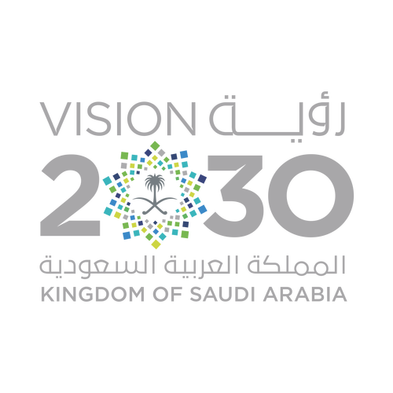
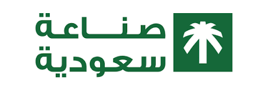
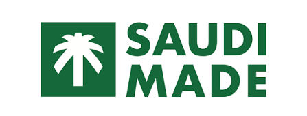

# دليل استخدام وتعديل موقع "الملاذ الآمن"

موقع إلكتروني ثنائي اللغة (عربي/إنجليزي) بتصميم فاتح/داكن، مبني بصفحات HTML بسيطة + ملف تنسيق واحد (CSS) + ملف جافاسكربت واحد (JS)، بدون أي أدوات بناء (Build Tools) أو أطر عمل (Frameworks) — عشان يبقى سهل التعديل عليه في أي وقت.

---

## 1. هيكل الملفات

```
almalath-alamen/
├── index.html          الصفحة الرئيسية
├── about.html           من نحن
├── journey.html          رحلة من المزرعة للمائدة
├── products.html         المنتجات
├── recipes.html          وصفات البلطي
├── quality.html          الجودة والاستدامة
├── partners.html         قائمة الشركاء/الموزعين (7 شركاء حاليًا)
├── partners/
│   ├── partner-1.html    العامر مول هايبر
│   ├── partner-2.html    شركة تموينات العبادي للمواد الغذائية
│   ├── partner-3.html    مطبخ العطية للحفلات والولائم
│   ├── partner-4.html    أسواق العامر الجوافا
│   ├── partner-5.html    مطعم فريج البن عاقول
│   ├── partner-6.html    مطبخ البستان
│   └── partner-7.html    أسواق العامر الرئيسي
├── contact.html          تواصل معنا
└── assets/
    ├── css/style.css     كل الألوان والخطوط والتنسيقات (ملف واحد فقط)
    ├── js/main.js        كل التفاعلات (اللغة، الوضع الداكن، الفلاتر، التابات...)
    ├── video/            فيديو الهيرو في الصفحة الرئيسية — شرح في القسم 12
    ├── certificates/      شهادة ISO (PDF + JPG) — شرح في القسم 17.ب
    └── img/
        ├── logo-lockup.png       الشعار الأفقي (للخلفية الفاتحة)
        ├── logo-lockup-dark.png  الشعار الأفقي (للخلفية الداكنة)
        ├── logo-icon.png         أيقونة الشعار (favicon)
        ├── logos/                شعارات رؤية 2030 وصنع في السعودية — شرح في القسم 17
        ├── partners/             شعارات الشركاء
        └── real/                 صور حقيقية من مزرعتكم (بدل صور Stock) — شرح تفصيلي في القسم 7
```

## 2. تعديل الألوان والخطوط (مكان واحد لكل حاجة)

افتح `assets/css/style.css` وابحث عن أول قسم فيه `:root {` — هتلاقي كل الألوان معرّفة كمتغيرات:

```css
--c-navy: #0b2e4a;     /* اللون الأساسي الغامق */
--c-blue: #1c6ea4;     /* الأزرق */
--c-orange: #e8862e;   /* البرتقالي (لون العلامة) */
--c-green: #2f9e5b;    /* الأخضر */
```

غيّر القيمة (كود اللون) هنا وهتتغير تلقائيًا في كل الموقع — مفيش حاجة تانية تلمسها.

## 3. الشركاء الحاليون (7 شركاء حقيقيون) وإضافة شريك جديد

الشركاء السبعة الحاليون كلهم منشآت حقيقية في محافظة الأحساء (الهفوف والقرن والحليلة)، وتم التأكد من أسمائهم وعناوينهم عبر روابط خرائط جوجل التي زوّدنا بها العميل. **ملاحظة مهمة:** لم نجد أرقام هواتف أو إيميلات مباشرة موثّقة لهذه المنشآت، فصفحة كل شريك حاليًا توجّه الزائر للتواصل مع فريق الملاذ الآمن مباشرة بدل رقم/إيميل خاص بالشريك (مكتوب عليه تعليق `<!-- TODO -->` في الكود). لو حصلتوا على رقم/إيميل مباشر لأي شريك، تقدروا تضيفوه في نفس المكان.

كل صفحة شريك (`partners/partner-N.html`) فيها بعد قسم "عن الشريك والموقع على الخريطة" زرار "الرجوع لكل الشركاء"، وبعده مباشرة قسم دعوة للتواصل (CTA) بعنوان "هل تودّ الانضمام إلى شبكة شركائنا؟". لو عايزين تغيّروا نص الدعوة دي، دوّروا في الملف على `cta-banner` (نفس النص مكرر في السبع ملفات، لازم تتغير في كل واحد منهم لو عايزين تعديل موحّد).

### شعارات الشركاء

شعار "العامر" (اللي بعته العميل) محفوظ بصيغة PNG بخلفية شفافة في `assets/img/partners/alamer-logo.png`، ومستخدم لـ3 شركاء من نفس العلامة التجارية: العامر مول (partner-1)، وأسواق العامر الحليلة (partner-4)، وأسواق العامر (partner-7).

الأربعة الباقيين (تموينات العبادي، مطبخ العطية، فريج البن عاقول، مطبخ البستان) معندناش لهم شعار رسمي ولا صورة حقيقية للمكان، فبدل الشعار حطينا أول كلمتين من اسم المكان مكتوبين فوق بعض (مثلاً "مطبخ" / "العطية") — ده مش شعار حقيقي، بس بديل نظيف لحد ما يتوفر شعار فعلي. لو حصلتوا على شعار حقيقي لأي واحد منهم:

1. حطوا صورة الشعار (يفضّل PNG بخلفية شفافة) في `assets/img/partners/`.
2. استبدلوا الـ`<div class="partner-logo-text">...</div>` بـ `` في 3 أماكن: داخل `<div class="partner-logo">` بصفحة `partners.html`، وفي تيزر الشركاء بـ`index.html` لو الشريك ده من ضمن الـ3 المعروضين، وداخل `<div class="partner-hero-badge">` في أعلى صفحة الشريك نفسه `partners/partner-N.html` (لاحظ إن مسار الصورة جوه مجلد `partners/` بيبدأ بـ `../assets/...` مش `assets/...`).

لإضافة شريك جديد:

1. روح لمجلد `partners/` وانسخ أي ملف موجود (مثلاً `partner-1.html`) وسمّي النسخة `partner-8.html`.
2. افتح الملف الجديد وغيّر: الاسم، الفئة (مول/سوبر ماركت/مطعم...)، المنطقة، العنوان، نبذة عنه.
3. لتغيير موقع الخريطة: خد رابط "مشاركة" (Share) من خرائط جوجل للمكان، وحط قيمة `q=` في رابط الـ iframe (`https://www.google.com/maps?q=...&output=embed`) اسم/عنوان المكان بالإنجليزي أو الإحداثيات (Latitude,Longitude)، وحط نفس رابط خرائط جوجل الأصلي في زرار "فتح الخريطة كاملة".
4. افتح `partners.html` وانسخ بطاقة (card) شريك موجودة، غيّر الاسم والمنطقة والرابط ليشاور على `partner-8.html`، وغيّر الحرفين في دائرة الشعار (`partner-logo`).
5. لو حابين، كرروا نفس الإضافة في قسم "شركاؤنا" المختصر بالصفحة الرئيسية `index.html`.

## 4. المنتجات (3 منتجات بلطي مبرّد فقط)

التركيز الحالي للموقع هو **البلطي المبرّد فقط** (مفيش حي أو مجمّد حاليًا)، بثلاثة أشكال تجهيز:

1. كامل منظف ومغلف — للقلي (`data-category="fry"`)
2. دفتر منظف — للشوي (`data-category="grill"`)
3. كامل غير منظف — بدون تغليف (`data-category="whole"`)

**ملاحظة:** تمت إزالة أي إشارة لـ"بدون عظم/خالٍ من العظم" من كل المنتجات في هذه الجولة، لأن هذه الميزة غير متوفرة فعليًا — التجهيز الحالي "دفتر" (Butterflied) فقط، مش فيليه بدون عظم بالكامل.

لإضافة شكل تجهيز جديد: افتح `products.html`، انسخ أي `<div class="product-item">` كامل والصقه، وغيّر الصورة/الاسم/الوصف/الفئة. لو الفئة جديدة كليًا، ضيف زرار جديد في `product-filter` بنفس اسم `data-filter`.

في نفس الصفحة فيه قسم "ليه تتعامل مع الملاذ الآمن؟" فيه 7 كروت (`value-prop-card`) بيوضحوا مميزات التعامل التجاري (إنتاج مستمر، جودة ثابتة، توريد منتظم، إلخ) — لتعديل أي منها غيّر النص جوه الكارت المناسب في `products.html`.

## 5. إضافة وصفة جديدة

افتح `recipes.html`، انسخ أي `<div class="recipe-card">` كامل والصقه، وغيّر العنوان والمكونات وخطوات التحضير. **مهم:** لازم تدي الكارت الجديد `id` مختلف عن الموجودين (مثلاً `id="recipe-6"`) — ده اللي بيخلي روابط "التفاصيل" من الصفحة الرئيسية توصل لنفس الوصفة وتفتحها تلقائيًا.

### وصفات الصفحة الرئيسية (تيزر)

في `index.html` فيه 3 كروت وصفات مختارة، كل واحد فيها رابط `href="recipes.html#recipe-N"` بيودي لصفحة الوصفات ويفتح نفس الوصفة تلقائيًا. لو غيّرت ترتيب الوصفات في `recipes.html` أو رقم الـ`id`، لازم تحدّث نفس الرقم في رابط الكارت المطابق بالصفحة الرئيسية.

### تابات "وصفات البلطي المعروفة" و"وصفات العملاء"

صفحة الوصفات فيها الآن **تابين (Tabs)** بدل قسمين تحت بعض: "وصفات البلطي (Tilapia) المعروفة" (فيه الوصفات الخمس الحالية) و"وصفات العملاء" (حاليًا فاضي وشكله "قريبًا" — بطاقة بحدود متقطّعة وأيقونة ونص بسيط وزرار "شارك وصفتك معنا" بيودي لصفحة "تواصل معنا"). الزائر بيضغط على اسم التاب فيتغيّر المحتوى تحته من غير ما يعمل سكرول لقسم تاني.

آلية التابات عامة وقابلة لإعادة الاستخدام في أي صفحة تانية: أي عنصر أب عليه الخاصية `data-tabs` يبقى جواه أزرار `data-tab-target="اسم"` وعناصر محتوى `data-tab-panel="نفس الاسم"` — الكود بتاع التبديل موجود في `assets/js/main.js` (قسم "12.ب) تابات عامة"). **لإضافة وصفة جديدة**: زي الأول تمامًا، انسخوا أي `recipe-card` كامل جوه `<div data-tab-panel="known">` وغيّروا النصوص. **لتفعيل قسم "وصفات العملاء"**: لما توصلكم وصفات حقيقية، احذفوا الـ`<div class="customer-recipes-placeholder">` جوه `<div data-tab-panel="customer">` واستبدلوها بكروت `recipe-card` عادية بنفس طريقة باقي الوصفات.

ملحوظة: نصوص المكونات وخطوات التحضير في الوصفات الخمس اتراجعت وتم تعديل صياغتها من العامية للعربية الفصحى/المبسطة عشان تناسب جمهوركم، من غير أي تغيير في المقادير أو الخطوات نفسها أو النسخة الإنجليزية.

## 5.ب الأرقام المتحركة (الإحصائيات والقيم الغذائية)

في الصفحة الرئيسية (5 كروت إحصائيات) وصفحة الوصفات (4 كروت قيمة غذائية)، الأرقام بتتحرك تلقائيًا (Counter Animation) لما الزائر يوصلها بالسكرول. كل رقم موجود جوه `<span data-count="الرقم">0</span>` — لتغيير أي رقم، غيّر قيمة `data-count` بس (يقبل أرقام عشرية زي `2.7` كمان)، والنص المكتوب جنبه (زي "سنة خبرة" أو "بروتين") تقدر تغيّره عادي زي أي نص تاني بـ `data-ar`/`data-en`. القيم الغذائية الحالية موثّقة من قاعدة بيانات وزارة الزراعة الأمريكية (USDA FoodData Central) لكل 100 جم بلطي مطهو.

## 6. الصور والفيديوهات

**تحديث:** معظم الصور في الموقع دلوقتي صور حقيقية من مزرعتكم (مش Stock)، محفوظة في `assets/img/real/` — تم اختيارها يدويًا من مجموعة الصور اللي بعتوها (طائرة درون، أحواض، فريق العمل، الفرز والتجهيز، الجودة والفحص، التوصيل، الحصاد، غرفة المراقبة). كل صورة بحجم معقول (أقل من 500KB) بعد ضغطها عشان الموقع يفتح بسرعة.

**تحديث إضافي:** ألبوم "لحظة الحصاد" في جاليري `about.html` بقى فيه صور حقيقية للحصاد الفعلي (الفريق بيجمع السمك، والسمك في الصناديق)، وألبوم "غرفة المراقبة والمتابعة" بقى فيه صورة حقيقية لأحد الفريق بيتكلم في جهاز اللاسلكي، وتم نقل هذا الألبوم ليكون آخر ألبوم في الصفحة (وقبله "فريق العمل"). صورة منتجَي "كامل غير منظف — بدون تغليف" و"دفتر منظف بدون عظم — للشوي" في `products.html` و`index.html` بقيا كمان صور حقيقية.

**الصور اللي لسه Stock (من Pexels) أو محتاجة صورة بديلة لعدم توفرها بعد:**
- خطوة "الحصاد في أوج النضج" في `journey.html` — لسه صورة Stock (لم تُطلب في هذه الجولة).
- صور أطباق الوصفات المطبوخة (بلطي بالليمون، صيادية بالأرز، مقلي مقرمش، بالطحينة والخضار) في `recipes.html` و`index.html` — محتاجين تصوير طبق نهائي جاهز واحترافي (Food Photography) لكل وصفة.

لو حصلتوا على صور حقيقية لأي من دول، حطوها في `assets/img/real/` وغيّروا الـ`src` (أو `data-images` لو جوه ألبوم الجاليري) بنفس طريقة باقي الصور.

**لتغيير أو إضافة أي صورة تانية:** ابحث عن رابطها الحالي (سواء `assets/img/real/...` أو `https://images.pexels.com/...`) واستبدله بمسار صورتكم الجديدة داخل `assets/img/` (مثلاً `assets/img/real/اسم-الصورة.jpg`).

**تنبيه مهم:** مزرعتكم مزرعة استزراع صناعي بأحواض مُجهّزة، **وليست** مزرعة أقفاص عائمة أو موقع بحري مفتوح. عند اختيار صور بديلة (سواء Stock مؤقت أو صوركم الحقيقية)، تجنبوا أي صورة تُظهر أقفاص عائمة أو قوارب أو مسطحات مائية مفتوحة حتى ما تدي انطباع غير دقيق عن طبيعة المزرعة.

**ملاحظة عن صور شركة "All Seas Fisheries":** جزء من الصور اللي بعتوها فيها شعار وزي شركة تعبئة/تغليف شريكة (All Seas، لوجو أزرق). ما استخدمناش أي صورة يظهر فيها شعارهم بوضوح — التزمنا فقط بالصور اللي عليها شعاركم أنتم (الملاذ الآمن) أو من غير أي شعار على الإطلاق.

## 7. تشغيل الموقع محليًا للمعاينة

الموقع صفحات HTML عادية، يعمل بفتح `index.html` مباشرة في المتصفح، أو برفعه على أي استضافة عادية (Hosting) بدون احتياج لأي إعدادات خاصة.

## 8. اللغة والوضع الداكن

كل نص في الموقع مكتوب مرتين داخل كل عنصر: `data-ar="..."` و `data-en="..."`. لتغيير أي نص، عدّل القيمتين. زر تبديل اللغة والوضع الداكن يعملان تلقائيًا عبر `main.js` ولا يحتاجان أي تعديل.

## 9. الهيدر (صفّين + ثبات عند السكرول)

الهيدر مكوّن من صفّين داخل `<header class="site-header">`:

- `header-top`: اللوجو + معلومات التواصل (تليفون/إيميل/موقع) + أزرار اللغة والوضع الليلي.
- `header-bar`: شريط التابات الملوّن + زر "اطلب عرض سعر".

لما تنزل بالسكرول، الصف الأول بيطلع لفوق ويفضل شريط التابات ثابت في أعلى الشاشة بعرض الشاشة كلها. ده شغّال بالـCSS مباشرة (`position: sticky` مع `top` بالسالب)، من غير أي جافاسكربت تقيل.

لتغيير رقم التليفون أو الإيميل أو العنوان: عدّلهم من قسم `header-info` في أول أي صفحة (وكرر نفس التعديل في باقي الصفحات).
لتغيير لون شريط التابات: غيّر `--c-blue` من ملف `style.css`، أو عدّل `.header-bar { background: ... }`.


## 10. الخط الزمني التفاعلي (رحلة السمكة)

في `journey.html`، كل مرحلة داخل `<div class="journey-step">` وجوّاها `<div class="timeline-node">` فيه الأيقونة ورقم المرحلة. الخط الرأسي بيتلوّن تلقائيًا كل ما تنزل (مع تأثير "الغوص" اللي بيغمّق الخلفية تدريجيًا). لإضافة مرحلة جديدة: انسخ أي `journey-step` كامل (بما فيه الـ`timeline-node`) والصقه في مكانه، وغيّر النص والصورة والأيقونة.

## 11. جاليري المزرعة (ألبومات)

موجود في `about.html`. كل كارت هنا **ألبوم** مش صورة واحدة: بيعرض صورة غلاف وعنوان ووصف، ولما تضغط عليه بتتفتح نافذة فيها كل صور الألبوم مع أسهم وصور مصغّرة للتنقل.

- **صور الألبوم** مكتوبة في `data-images` على الكارت، مفصولة بعلامة `|`.
- **عنوان الألبوم** في `data-album-ar` و `data-album-en`.
- **لإضافة ألبوم**: انسخ أي `gallery-item` كامل وغيّر الصور والعناوين و`data-category`.
- الفئات الحالية: `farms` / `production` / `team` / `quality`. لإضافة فئة جديدة ضيف زرار في `gallery-filter` بـ `data-filter` بنفس الاسم.
- **ألبوم "فريق العمل"** فيه 4 صور حاليًا. لو وصلتكم صورة خامسة للفريق، ضيفوها في نهاية `data-images` (بعد آخر علامة `|`) وغيّروا رقم العدّاد `<span>4</span>` داخل `album-count` لنفس الألبوم إلى `<span>5</span>`.
- **ألبوم جديد "العمليات اليومية بالمزرعة" (Daily Farm Operations)**: تمت إضافته بعد ألبوم "أحواض المزرعة" مباشرة وقبل "لحظة الحصاد"، وفيه 6 صور حقيقية (تغذية بالعربة، تغذية بالمغرفة، جهاز قياس جودة المياه، إطلاق إصبعيات في الحوض، متابعة الحوض، لافتة مدخل المزرعة). الفئة `data-category="farms"` زي "أحواض المزرعة" و"غرفة المراقبة" عشان يظهر مع نفس الفلتر.


## 12. فيديوهات الموقع

فيه 3 أماكن فيديو مختلفة في الموقع، متغيّرة عن بعض:

### أ) فيديو الهيرو في الصفحة الرئيسية

أول حاجة تظهر لما تفتح `index.html`، داخل `<section class="hero"><div class="hero-media"><video>`. الفيديو الحالي (`assets/video/hero-farm.mp4`، صورة الغلاف/poster: `assets/img/real/hero-poster.jpg`) هو فيديو جوي حقيقي لأحواض مزرعتكم بعثتوه لينا، تم ضغطه (من ~34 ميجا 4K الأصلية إلى ~4 ميجا 1280px) عشان الموقع يفتح بسرعة من غير ما تقل الجودة بشكل ملحوظ. **لتغييره:** استبدلوا ملف `assets/video/hero-farm.mp4` بفيديو جديد بنفس الاسم (يفضّل ضغطه أولاً بنفس الطريقة — قولوا لأي حد يعرف يستخدم `ffmpeg` يعمل: `ffmpeg -i المدخل.mp4 -vf "scale=1280:-2" -an -c:v libx264 -crf 26 hero-farm.mp4`)، وحدّثوا صورة `poster` لو حبيتوا غلاف مختلف قبل ما الفيديو يشتغل.

### ب) الفيديو التعريفي (Promo Video)

موجود في الصفحة الرئيسية وصفحة "من نحن" داخل `<div class="promo-video">`. لتغيير الفيديو: غيّر رابط `<source src="...">` ورابط `poster`.

**وضع "الفيديو قريبًا" الحالي:** لحد ما يتوفر فيديو حقيقي، الكارت شايل خاصية `data-video-pending` على `<div class="promo-video">`، وده بيخلي الضغط على زرار التشغيل ما يعملش حاجة (الفيديو الوهمي الحالي متوقف عمدًا)، وبيظهر شريط صغير مكتوب فيه "سيتم إضافة الفيديو قريباً" أسفل يسار الكارت. **لما يتوفر فيديو حقيقي:** احذفوا خاصية `data-video-pending` من الـ`<div>` (في `index.html` و`about.html`)، وحدّثوا رابط `<source src="...">` و`poster` بالفيديو الجديد — هيرجع الزرار يشتغل تلقائيًا وهيختفي شريط "قريبًا" من غير أي تعديل تاني في الكود.

### ج) هيرو صفحة "رحلتنا"

كان فيه فيديو Stock هنا، وتم استبداله بصورة جوية حقيقية لمزرعتكم (`assets/img/real/journey-hero-farm.jpg`) بناءً على طلبكم. لو حبيتوا ترجعوا فيديو هنا بدل الصورة، افتحوا `journey.html` ودوّروا على `<div class="hero-media">` الموجود في هيرو الصفحة الرئيسية.

## 13. تأثير الغوص عند السكرول

في صفحة "رحلتنا" فيه تأثير بسيط بيغمّق الخلفية تدريجيًا مع فقاعات وأنت نازل، كأنك بتنزل تحت الماء. لو مش عايزه: احذف `class="dive-zone"` و`<div class="dive-overlay"></div>` و`<div class="bubbles"></div>` من القسم.


## 14. الشعار (اللوجو)

الشعار صورة PNG جاهزة مأخوذة من ملف الهوية الرسمي، بنسختين:

- `logo-lockup.png` — للخلفيات الفاتحة (النص بالأخضر الغامق).
- `logo-lockup-dark.png` — للخلفيات الداكنة (النص أبيض)، وبتظهر تلقائيًا في الوضع الليلي وفي الفوتر.

التبديل بينهم بيتم تلقائيًا بالـCSS، فمش محتاج تعمل حاجة. لو حبيت تغيّر مقاس الشعار، غيّر `height` في `.brand img` داخل `style.css`.

## 15. نموذج التواصل — خطوة تفعيل لمرة واحدة ⚠️

الفورم في صفحة "تواصل معنا" بيبعت الرسائل على **almalath.alamen1@gmail.com** عن طريق خدمة FormSubmit المجانية (من غير سيرفر).

**مهم جدًا بعد رفع الموقع على الاستضافة:**

1. افتح صفحة "تواصل معنا" على الموقع بعد رفعه، واملأ الفورم وابعت رسالة تجريبية.
2. هتوصل رسالة من FormSubmit على إيميل المؤسسة فيها لينك تفعيل — اضغط عليه **مرة واحدة بس**.
3. بعد كده كل رسائل الزوار هتوصل على الإيميل تلقائيًا.

لتغيير الإيميل المستقبِل لاحقًا: افتح `contact.html` ودوّر على `action="https://formsubmit.co/..."` وغيّر الإيميل، وكرر خطوة التفعيل.

## 16. بيانات التواصل والسوشيال

كلها مكتوبة في الهيدر (`header-info`) والفوتر (`footer-contact`) في كل صفحة:

- التليفون/واتساب: `+966573971553` — مكتوب بخاصية `dir="ltr"` عشان علامة + تفضل على الشمال.
- الإيميل: `almalath.alamen1@gmail.com`
- السوشيال في الفوتر: سناب شات وتيك توك شغّالين، وإنستجرام مكانه محجوز بـ `href="#"` — لما يبقى فيه حساب، غيّر `#` بالرابط.

### خريطة صفحة "تواصل معنا"

الخريطة في `contact.html` خريطة جوجل حقيقية (مش OpenStreetMap زي الأول) مأخوذة من رابط الموقع اللي بعتوه، وبتأشّر بالظبط على "الملاذ الأمن للاستزراع السمكي" المسجّل على جوجل ماب (شارع المشرد 5، القطيف 32749). **تنبيه:** بناءً على طلبكم تم تعديل نص عنوان هذه الصفحة ليقول "المنطقة الشرقية، الدمام" (متسقًا مع باقي الموقع)، لكن **الخريطة نفسها (الـ iframe) لسه بتأشّر على نفس الموقع الفعلي المسجّل في القطيف** لأننا معدّلناش رابط الخريطة. لو حابين الخريطة كمان تتغيّر لموقع في الدمام، ابعتولنا رابط "مشاركة" (Share) من جوجل ماب للموقع الصحيح.

**لتحديث موقع الخريطة لاحقًا**: خدوا رابط "مشاركة" (Share) من جوجل ماب للمكان الجديد، وابعتوه لينا أو اتبعوا نفس خطوات تحديث خريطة صفحة الشريك في القسم 3.

## 17. شعارات رؤية 2030 وصنع في السعودية

الشعارات محفوظة في `assets/img/logos/`:
- `vision-2030.png` — شعار رؤية 2030 (نسخة واحدة، مدموج فيها العربي والإنجليزي معًا — مفيش نسخة منفصلة لكل لغة اتبعتت لينا).
- `saudi-made-ar.png` — شعار "صناعة سعودية" بالعربي فقط.
- `saudi-made-en.png` — شعار "SAUDI MADE" بالإنجليزي فقط.

الشعارين بتوع "صنع في السعودية" بيتبدّلوا تلقائيًا حسب لغة الموقع الحالية (شغّال بكلاس `lang-ar-only` / `lang-en-only` في `style.css`، بيعتمد على خاصية `lang` بتاعة الصفحة اللي بيغيّرها زرار اللغة). أما شعار رؤية 2030 فبيفضل نفس الصورة في اللغتين، لأنه مدموج ومفيش نسخة منفصلة له.

الشعارات مستخدمة حاليًا في 4 أماكن:

1. **الصفحة الرئيسية** — شريط مستقل بشعار رؤية 2030 بحجم أكبر (كلاس `logo-badges lg`) مع جملة "نفخر بدعم مستهدفات الأمن الغذائي..."، موجود مباشرة تحت قسم الهيرو (أول ما تنزلوا شوية من أعلى الصفحة) عشان يبان واضح من البداية.
2. **فوتر كل صفحات الموقع** (الرئيسية وكل الصفحات الداخلية وصفحات الشركاء السبعة) — شارات صغيرة جنب جملة "صُنع بفخر في المملكة العربية السعودية 🇸🇦" أسفل الفوتر.
3. **صفحة "من نحن"** — شعار رؤية 2030 تحت فقرة "رسالتنا"، لأنها بتذكر رؤية 2030 صراحة.
4. **صفحة "الجودة والاستدامة"** — شعار "صنع في السعودية" (عربي/إنجليزي حسب اللغة) تحت قائمة نقاط الاستدامة البيئية (قرب نقطة "أعلاف محلية سعودية 100%").

كل الأماكن دي مبنية بكلاس CSS واحد اسمه `logo-badges` (فيه نسخة أكبر بكلاس إضافي `lg` مستخدمة في صفحتي "من نحن" و"الجودة") — بيحط الشعار جوه شارة بخلفية بيضاء وظل خفيف عشان يبان واضح فوق أي خلفية غامقة أو فاتحة. لإضافة الشعارات في مكان جديد، انسخوا نفس النمط:
```html
<div class="logo-badges">
  
  
  
</div>
```

## 17.ب شهادة ISO 45001:2018

شهادة "ISO 45001:2018 Internal Auditor" (اعتماد معتمد من IIRSM) محفوظة في `assets/certificates/` بصيغتين: `iso-45001-certificate.pdf` (الملف الأصلي) و`iso-45001-certificate.jpg` (نسخة صورة منها لعرضها كصورة مصغّرة في الموقع). معروضة في مكانين:

1. **صفحة "الجودة والاستدامة"** — بانر كامل (صورة مصغّرة + شرح + رابط "عرض الشهادة كاملة (PDF)") تحت كروت معايير الجودة الأربعة، بمعرّف `id="iso-cert"` عشان يتفتح عليه مباشرة من أي لينك بيشاور له `#iso-cert`.
2. **الصفحة الرئيسية** — نفس البانر الكامل بالظبط (نفس الشكل والنصوص)، تحت كروت "لماذا تختارنا؟" مباشرة، بمعرّف `id="iso-cert"` هنا كمان. زرار "عرض الشهادة كاملة (PDF)" بيفتح ملف الـPDF مباشرة في تاب جديد.

**لتحديث الشهادة** (شهادة جديدة أو إضافة شهادات تانية): استبدلوا الملفين بنفس الاسمين في `assets/certificates/` لو نفس النوع، أو لو شهادة جديدة كليًا انسخوا نفس نمط الـ`iso-cert-banner` في `quality.html` وغيّروا اسم الملفات والنصوص.

## 18. ملاحظات ونواقص معروفة من هذه الجولة

- **إحداثيات خرائط جوجل للشركاء 5، 6، 7** (فريج البن عاقول، مطبخ البستان، أسواق العامر الرئيسي) لسه شايلة نفس الإحداثيات القديمة، رغم إن بعض العناوين اتغيّرت (زي مطبخ البستان اللي بقى في "المبرز المسعودي"). محتجناش نضيف إحداثيات جديدة من عندنا عشان منضللكمش بموقع غلط على الخريطة. لو حابين تحدّثوها: افتحوا خرائط جوجل، دوّروا على المكان الصحيح، خدوا رابط "مشاركة" (Share)، وغيّروا بيه قيمة الـ`src` في الـ`iframe` بصفحة الشريك المعنية (`partners/partner-5.html`, `partner-6.html`, `partner-7.html`) وكمان الرابط في زرار "فتح الخريطة كاملة".
- **تسمية "بلطي (Tilapia)"**: بناءً على طلبكم، تمت إضافة "(Tilapia)" بعد كل ذكر لكلمة "بلطي" في كل المحتوى العربي بكل صفحات الموقع (ما عدا محتوى النسخة الإنجليزية اللي أصلاً مكتوبة "Tilapia").
- **حذف قسم "مسيرتنا / محطات مهمة"**: القسم اللي كان فيه خط زمني بتواريخ افتراضية (Placeholder Dates) في صفحة "من نحن" تم حذفه بالكامل بناءً على طلبكم. لو حابين ترجعوه مستقبلاً بتواريخ حقيقية، محتاجين نعمله من جديد.
- **استبدال عبارات "بدون هرمونات صناعية"**: كل الإشارات لعدم استخدام هرمونات نمو في كل الموقع (`journey.html`, `quality.html`, وغيرهم) استُبدلت بعبارة "أعلاف محلية سعودية 100%" بناءً على طلبكم.
- **تفتيح التظليل فوق فيديو/صورة الهيرو**: الطبقة الغامقة اللي فوق فيديو الصفحة الرئيسية وصورة صفحة "رحلتنا" (`.hero-media::after` في `style.css`) تم تخفيف غمقانها بناءً على طلبكم.
- **صورة هيرو صفحة "رحلتنا"**: تم استبدالها بصورة جديدة بعثتوها لينا (نفس المزرعة، منظر مختلف فيه رشّ مياه من المهوّي في المقدمة) — بنفس اسم الملف `assets/img/real/journey-hero-farm.jpg`، فمفيش أي تغيير مطلوب في كود `journey.html` نفسه.
- **توحيد نص العنوان على "الدمام"**: بناءً على طلبكم، تم تعديل نص العنوان في صفحة "تواصل معنا" ليكون "المنطقة الشرقية، الدمام، المملكة العربية السعودية" بدل عنوان القطيف التفصيلي، عشان يتسق مع باقي الموقع. تفاصيل خريطة الـ iframe نفسها موضحة في القسم 16 فوق.

---

بالتوفيق! أي تعديل بسيط تقدر تعمله بنفسك من غير أي أدوات برمجية معقدة، فقط محرر نصوص عادي (زي Notepad أو VS Code).
